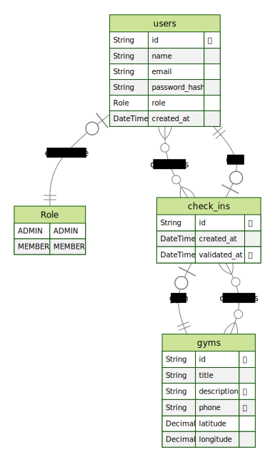

# APP - GymPass style app

API para usuário fazer check-in em academias. Conceitos presentes no projeto `SOLID`, `DESIGN PATTERNS`, `DOCKER`, `JWT`, `REFRESH TOKEN`, `RBAC`

Linguagem: `TYPESCRIPT`

Banco de dados utilizado: `POSTGRESQL`

ORM: `PRISMA`

Aplicação com docker para gerar o banco de dados

## Requisitos funcionais
O que é possível que o usuário faça na aplicação.

- [x] Deve ser possível se cadastrar;
- [x] Deve ser possível se autenticar;
- [x] Deve ser possível obter o perfil de um usuário logado;
- [x] Deve ser possível obter o número de check-ins realizados pelo usuário logado;
- [x] Deve ser possível o usuário obter seu histórico de check-ins;
- [x] Deve ser possível o usuário buscar academias próximas;
- [x] Deve ser possível o usuário buscar academias pelo nome;
- [x] Deve ser possível o usuário realizar check-in em uma academia; 
- [ ] Deve ser possível validar o check-in de um usuário;
- [x] Deve ser possível cadastrar uma academia;

## Regras de negócio
Determina condições que serão aplicadas para cada requisito funcional.SEMPRE é associada à um requisito funcional

- [x] O usuário não deve poder se cadastrar com um e-mail duplicado;
- [x] O usuário não pode fazer 2 check-ins no mesmo dia;
- [X] O usuário não pode fazer check-in se não estiver perto (100m) da academia;
- [ ] O check-in só pode ser validado até 20 minutos após criado;
- [ ] O check-in só pode ser validado por administradores;
- [ ] A academia só pode ser cadastrada por

## Requisitos não funcionais
Requisitos que não partem do cliente, são requisitos mais técnicos. ex: Qual banco de dados será utilizado.

- [x] A senha do usuário precisa estar criptografada;
- [x] Os dados da aplicação precisam estar persistido em um banco PostgreSQL;
- [x] Todas listas de dados precisam estar paginadas com 20 itens por página;
- [ ] O usuário deve ser identificado por um JWT (JSON Web Token);

## Diagrama ERD
<div align="center">
    
</div>

## Instalação
```sh
# Faça o clone do repotório
  git clone git@github.com:RenanFachin/RS_IGNITE_api-solid.git

# Instalar as dependências do projeto
  npm install

# Rodar as migrations do projeto para criar o banco de dados
  npx prisma migrate dev

# Executando o projeto no ambiente de desenvolvimento
  npm run dev
```


## Instalação do banco de dados
```sh
# Subindo o banco de dados com docker
docker compose up -d
```